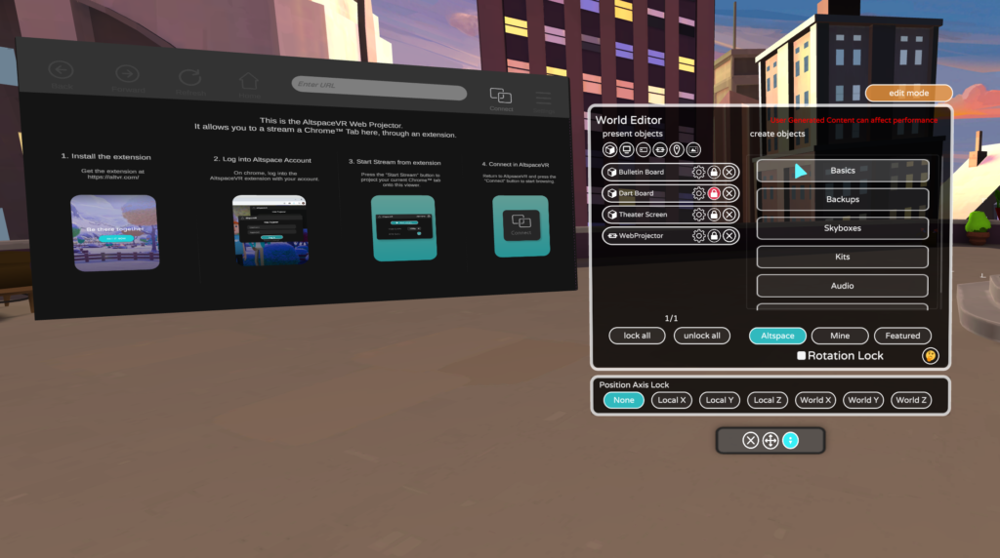

# Using the Web Projector to stream an Edge browser tab

The AltspaceVR Web Projector is a robust media-sharing solution that allows you to stream a designated Edge browser tab from your computer directly into AltspaceVR. It can be used to share slides, videos, photos, and just about anything else you can open up from a browser. The Web Projector requires downloading a browser extension on your computer and is currently available exclusively through the **World Editor > Editor Panel > Web Projector** in AltspaceVR. Below is a complete overview of the feature and how to use it.

> [!NOTE]
> Web Projector does not use your Microsoft Account (MSA) login. You need to log into the Web Projector with your AltspaceVR account's email and password. If you don't have a password, you can create a new password by logging into altvr.com, going into your Profile, looking for 'Forgot or didn't get a password?' then selecting 'Sign out and get a new password'.

## Requirements

1. You must use a PC or Mac to stream your browser.
2. The necessary browser extension is currently supported by the Edge browser.
3. If you have everything set up correctly (logged into the browser extension/AltspaceVR with the same account, connected/broadcasting with Web Projector in AltspaceVR) and are still seeing a green screen, here are some things to look in to. Web Projector needs TCP port 443 open, and UDP port range 20000-20400. If you are on a Corporate network you may also need to open up UDP ports 5055 and 5056, TCP ports 80 and 443, allow-list wss://multicast.altvr.com/streams & https://www.altvr.com and these IP Ranges: https://www.microsoft.com/en-us/download/details.aspx?id=56519

> [!NOTE]
> This feature is primarily intended to stream one Edge browser tab of your choice. If you're attempting to instead stream your Desktop Application, the Web Projector will stream all computer audio (including AltspaceVR) which may result in echo/feedback. You'll need to mute AltspaceVR in order to prevent this from happening. Alternatively, you can also use a 2nd computer to run AltspaceVR while you use the Web Projector from your other computer.

## Getting started

1. To begin, you'll need to download and install the Edge browser extension: **[https://account.altvr.com/web_projector](https://account.altvr.com/web_projector)**.
2. Next, [sideload your extension in your Edge browser](/microsoft-edge/extensions-chromium/getting-started/extension-sideloading).
    * Once your download is complete, Unzip the .zip file.
    * Go to the **Extensions/Manage Extensions** section of your Edge browser.
    * Toggle on **Developer Mode** and select **Load Unpacked**.
    * Choose the folder that you just unzipped. This is the Web Projector extension.
    * Once your extension has been added, you can go into **Details** to set up your settings.
    * You should now see the AltspaceVR Web Projector icon towards the right of the URL bar.

## Setting up a shareable browser

Once your extension is downloaded and installed, you're ready to use it!

1. Open a tab in your Edge browser and navigate to the media you'd like to share.
2. Set up your window so you're ready to share. (Note: your whole browser window will be projected in-world, toggle F11 for full screen)
3. Locate and select the newly installed extension (which is displayed as an AltspaceVR icon near your URL bar in your browser). You'll be prompted to log into your account. (*Note: It's important that you log into the same account you'll use to set up your Web Projector.)
4. Once you're logged in, you should see the extension screen offer you a **Start Streaming** option. Select it.
5. **Note: Currently having an issue with the pop-up panel disappearing, open a new tab or switch between tabs and select the icon to get the panel showing again.**

## Projecting your browser in-world

1. Once your browser is set up for projection and you have started streaming via the extension, open AltspaceVR.
2. Set up the Web Projector in your environment of choice by opening your **World Editor > Editor Panel > Basics > Web Projector**.
3. Once placed, you can use your World Editor controls to resize the Web Projector. (It will also include instructions, on screen.)
4. Select the **Connect** button to begin streaming your Edge browser.
5. Remember to click **Broadcast** to begin sharing with all guests in the space.
6. Don't forget to **Stop Streaming.** Your session will time out eventually, but until then it will continue to live-project your browser. It's best to end your session as soon as you're done.

## Web Projector Mirror

You can also use multiple Projector Mirrors in your space: **World Editor > Editor Panel > Basics > Projector Mirror**. The Mirrors don't have the grey unclickable control buttons and are perfect for using as your main displays during an event.

## Video-Streaming Tip

If video stutters, stop streaming, adjust video quality to 480p or 360p, then restart your stream and broadcast. Higher resolutions may strain CPU and upload bandwidth. Just changing from 720p to 480p doesn't change the quality, you need to stop the Web Projector, change settings and start again.

> [!NOTE]
> The additional control buttons at the top of the Web Projector are not yet live. They will remain grey and unclickable. This is not a bug, it is by design (for now).

> [!IMPORTANT]
> DISCLAIMER: 
> Note: usage of the Web Projector, like all other features in AltspaceVR, is subject to our [Terms of Service](../community/terms-of-service.md) and our [Community Standards](../community/community-standards.md). As such, the Web Projector may not be used to stream content that is in violation of either agreement. Doing so will result in moderation actions taken by AltspaceVR.
