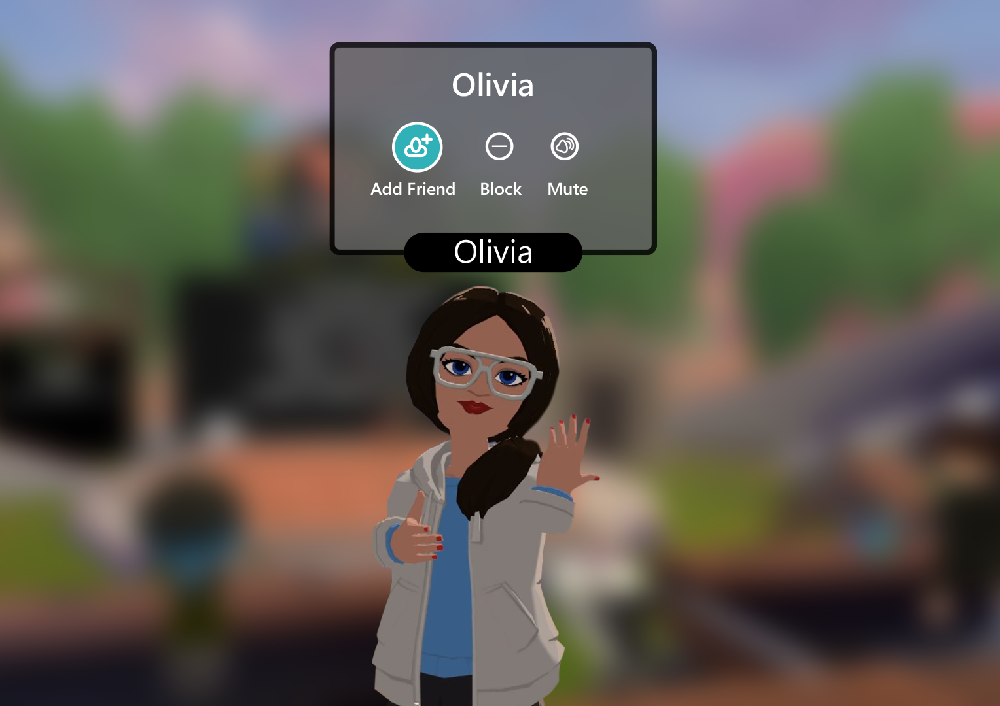

# User safety and moderation

This is a quick guide to AltspaceVR safety tools, where you can learn about the Safety Tools available to you.

AltspaceVR is an open, social virtual reality platform. That means it’s a place to meet all kinds of people worldwide. Before you jump in, we recommend getting familiar with the various safety tools available. These features allow you to better control your experience and give you options in various situations. 

You can find safety tools in two different places. Start with the Main Menu:

And in the name tags of other people, which appear when you click on their avatars:

## Safety tools

### Space Bubble 

To Turn your Space Bubble on or off, go to **Main Menu -> Settings -> General -> Personal Space Bubble**.

Your Space Bubble is on by default. People who get too close to you will disappear from your field of view. Turn it on if you’re feeling a bit crowded or if your view is blocked. Whatever is in your way will disappear.  

>[!Tip]
>If you’re new to VR, leaving your Space Bubble on can help you feel more comfortable in immersive spaces.) 

### Mute Yourself 
 
When you first enter a space, you're automatically muted. You can unmute yourself anytime you wish. Your microphone's **mute/unmute** button is on your Radial Menu.  

>[Tip] 
>It helps to stay muted whenever you’re not actively speaking, reducing the likelihood of disruptive audio feedback. 

### Mute Others

You can also mute other people in the space with you. Maybe someone has a noisy mic, or you’d rather not listen to what someone is saying—you can mute them anytime you wish. Click their avatar and bring up their nametag to find the Mute button.  

>[!Tip] 
>Muting someone from their nametag is a local mute. You're only muting them for yourself, not for others. Only Event Hosts and World Owners can mute other people's microphones. 

### Block

When clicking on someone's avatar, you can find the **block** button on the person's nametag.

Sometimes you may need to block another person. Blocked individuals will disappear entirely from your field of view, and you'll no longer see or hear them. Users you have blocked won't be able to see or listen to you either. When you block someone, you can select a reason for the block. This action alerts our Moderation Team and lets them know what to keep an eye on. 

>[!Tip] 
>Blocking people is a good way to disengage from an uncomfortable situation or an unfriendly person. 

### Quick exit to **Title Screen**

If you need to exit a space or situation quickly, you can do so by returning to your Title Screen. The Title Screen button is always available to you on your Radial Menu. Clicking this button immediately drops you back in your command center, removing your avatar from the previous space and scene.  

>[!Tip] 
>The Title Screen houses all of your primary settings and customization options, but it’s also a great solo space where no one else can appear or follow you.

While we strive to make AltspaceVR inclusive, welcoming, and mature, we also believe that every Altspacer should have access to safety tools. These tools allow you to control your experience.  

## Sending in a Report 

Sometimes you'll want to reach beyond these tools and ask for extra support. Remember, you can always file a report with our Moderation team at [altvr.com/report](altvr.com/report). 

## Reporting an Event or World? 

Remember, Event Hosts have access to additional [Safety and Moderation tools](tutorials/host-tools-overview.md#moderation-tools) in their event spaces. They can use these tools to help maintain a safe and welcoming atmosphere in their events. 

## See also

Are you new to AltspaceVR? Start your journey here.
> [!div class="nextstepaction"]
> [Exploring AltspaceVR](./explore/beginners-guide.md)

Do you have virtual events to bring to the world? Follow the steps here.
> [!div class="nextstepaction"]
> [Hosting events](./explore/host-events.md)

Learn more about event host safety and moderation tools.
> [!div class="nextstepaction"]
> [Event host safety and moderation tools](tutorials/host-tools-overview.md)
