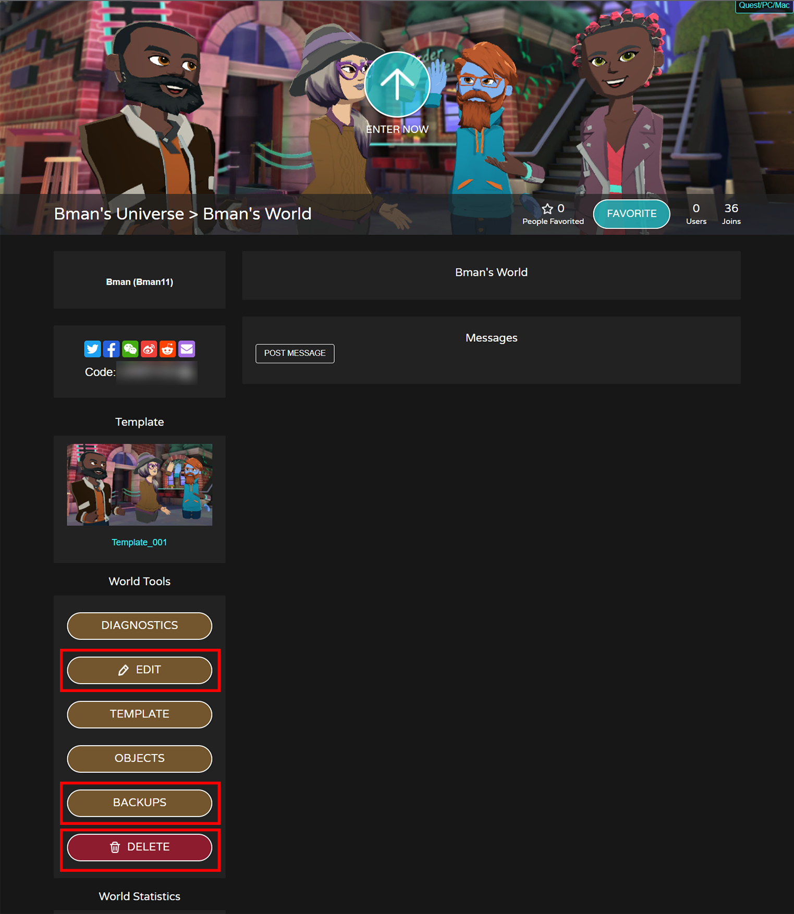

# Backing up your worlds

A Backup is a “snapshot” or record of all the objects in a World at a specific point in time. Suppose you’re building your Dream House and one day you accidentally deleted the living room. If you had created a Backup of your World the day before, you could restore that particular backup, reset your World, and avoid a panic attack. Or perhaps you have a version of your cabin-in-the-woods for every season and you like to switch back and forth between them—you can do that with Backups. Each Backup is specific to a single World and contains not only the transforms (position, rotation, scale) but also other settings on the objects. There's no limit to the number of Backups you can create for a World.  

## What’s included in a Backup?

A Backup currently includes most things you can spawn with the World Editor:
* Artifacts (Kit objects)
* Labels
* Teleporters
* Spawn Points
* Photos
* MRE SDK Apps
* Native Apps (for example, Holograms Against Reality)

The following isn’t included:

* Layout overrides
* Skyboxes and ambient sound
* Templates
* Instructions
* World roles and contextual roles

## Managing Backups

You can create a Backup by opening your World Editor / Altspace and clicking on “Backups”. The first button will be the “New Backup” button. When creating a Backup, you’ll be asked to provide a short name. This is optional but highly recommended because it will get confusing fast. Existing backups will be listed after the “Create” button. Clicking on an existing Backup will start a restore. When restoring a Backup, your World will reset after a few moments but you may not see the changes reflected. Wait a minute or two and reset your World again. **There's currently no way to edit or delete a Backup in VR**. You'll need to manage your Backups on our website for now. (Backup management in VR will be improved soon. In the meantime, bear with us).

To manage your Backups on our website:

1. Navigate to [Worlds > Mine](https://account.altvr.com/users/sign_in), find your World, and press “Backups” in the Administrator Controls:

    

2. You can create, edit, and delete your Backups, check how many objects are inside, and even upload a preview image.

There's no limit to the number of Backups and having more Backups won't impact the performance of your World.

## Other ways to back up your Worlds

* Create another World, Show Advanced Options, and Import from World. Choose the World you want to back up from the dropdown menu into the new one. There no limit for imports.
* If you’re using the Unity Uploader, we strongly recommend you use version control. For example, [Github for Unity](https://unity.github.com).

## Troubleshooting

**Help! I accidentally restored a Backup and my work is gone**
Don’t worry. We automatically create a new Backup before restoring old one. Look for one with a name starting with **Auto** with the right timestamp and restore that one (for example, **Auto 2019-01-14T08:23:33-08:00**).  If that doesn’t work submit a [Support request](https://altvr.com/support)

**I restored a Backup and some objects are missing**
If any were photos, were those photos deleted? We can’t restore deleted photos for privacy reasons. Submit a [Support request](https://altvr.com/support) so we can investigate

**I don’t see any changes**
Backups are restored asynchronously meaning they can take a few minutes to restore depending on the number of objects. Remember to reset your World and if you don’t see anything after a few minutes try resetting again. In the future, we can provide more feedback on the status of the restoration process