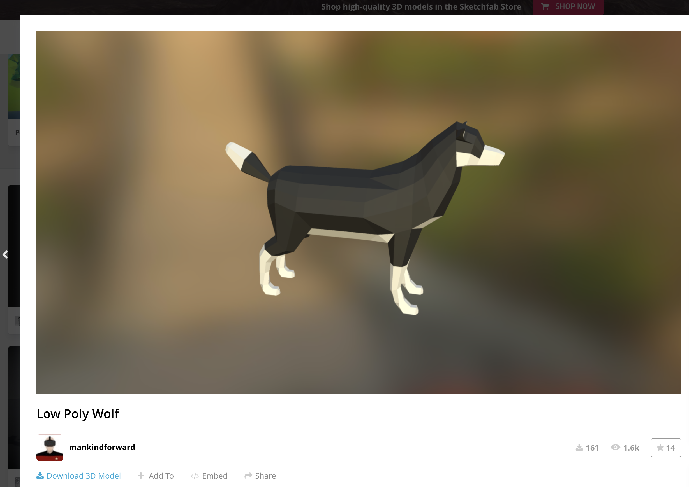
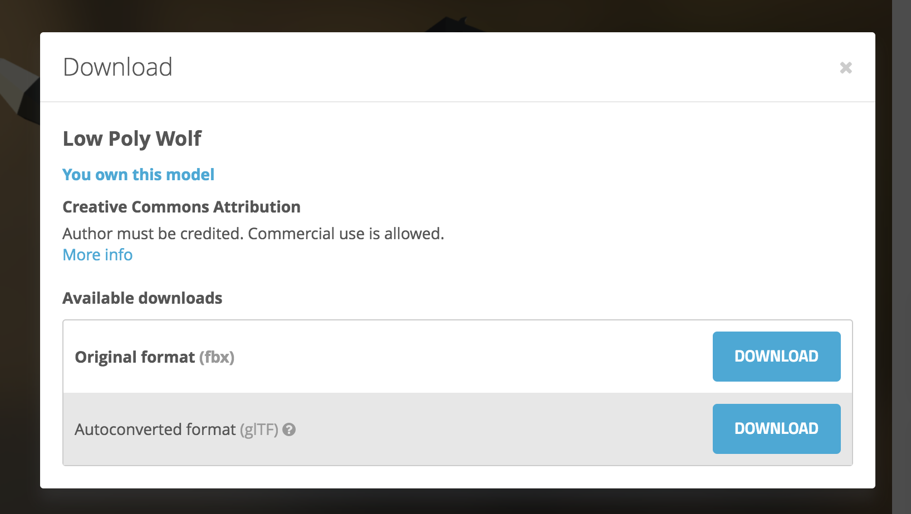
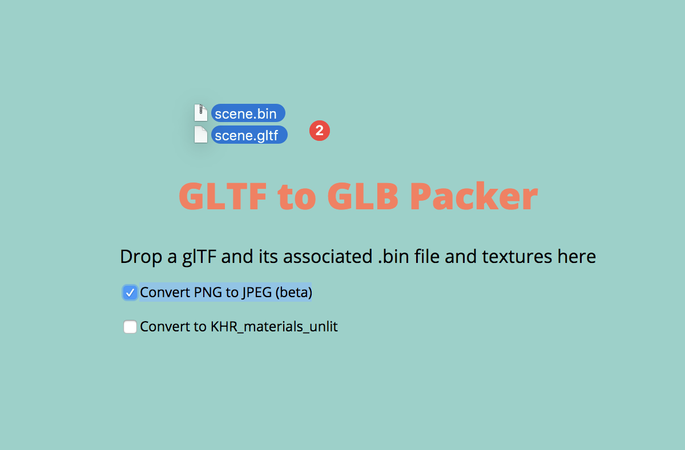

# Importing glTF models

> [!NOTE]
> This feature is available for select users in the Early Access program at this time.

One way to bring 3D models and scenes into Altspace is using the [glTF standard](https://en.wikipedia.org/wiki/GlTF). You can upload a .glb file (packed glTF) to create a Model that you can later spawn in the World Editor. It's an alternative to [uploading your own Kits](uploading-custom-kits.md). We recommend creating Models for quick demonstrations since you won't need to use Unity and recommend creating Kits when you want to maximize performance and reusability. 

1. Find some glTF 3D assets. One place to search is Sketchfab (try filtering for "Downloadable" models like [this](https://sketchfab.com/search?features=downloadable&q=low+poly+wolf&sort_by=-pertinence&type=models)). Once you find it, click "Download 3D Model":

2. Copy the link to the model and read the licensing requirements. 
3. Download the "Autoconverted Format (glTF)" version

4. Open the [GLB Packer](https://glb-packer.glitch.me) site and check the box "Convert PNG to JPEG (beta)"
5. Uncompress the glTF files you just downloaded and drag them all at once into the GLB Packer browser tab

6. Depending on the number and size of the files, it may take a while to process. When it'd done, an "out.glb" file will be downloaded. Rename that file to something informative--this will be the name of the object in the world (e.g "Low Poly Wolf.glb")
7. Navigate to [altvr.com > More > Models](https://account.altvr.com/users/sign_in) and click "Create"
8. Specify the location of the .glb file and make sure you copy the Sketchfab link into the description for attribution. Specify a preview image if you so desire and click "Create Model":

9. Click "Copy to Clipboard"
10. Open the World Editor > Altspace > Basics > GLTF
11. Paste in your url and click "Confirm"

Congrats! You just spawned your first Model.

## Troubleshooting

* When I clicked "Confirm" nothing happened
    * We currently have a 100k polygon limit. If it fails, please delete the Object to avoid potential problems with users joining your World
    * There may be other problems with the asset. Try to use assets with as few polygons as possible.
    * The model you're bringing in may be very small or very large. Try increasing/decreasing the Scale or move your avatar around, you might be standing inside the model!
* It's really slow to load
    * How quickly other users in the World load it will depend on their connection speeds. It's also not cached like Kit assets so if you place one in your Home, example, you'll end up re-downloading the same Model every time you join, which isn't great.
* There's no collision
    * By default there's no collision on the objects that are brought in this way
* When I spawn it, I lose my controls on 6 DOF or I'm inside so it's hard to manipulate it
    * Yes, we're aware of these issues and hope to address them soon.  