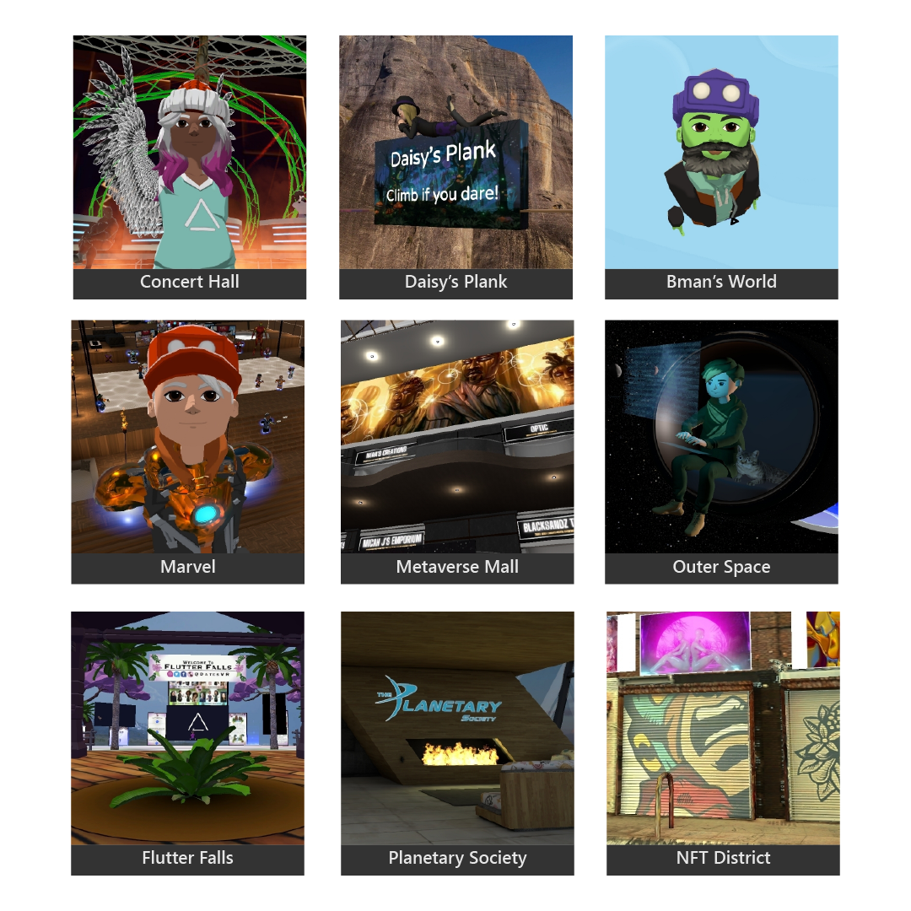
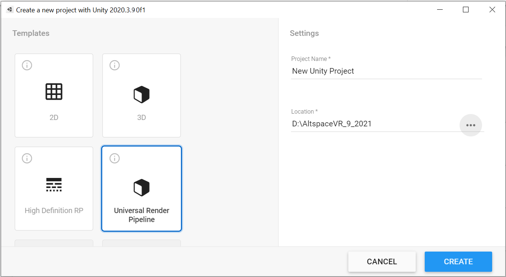
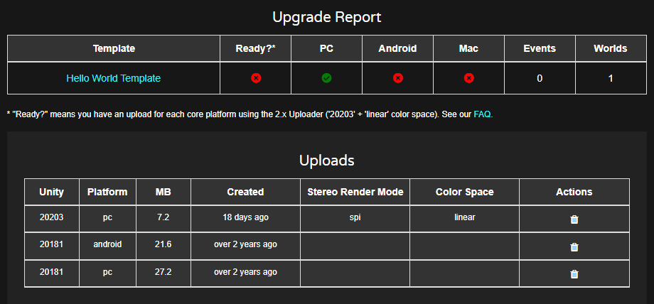

# Introducing the Altspace Uploader

> [!NOTE]
> - If you're interested, please join the [Official AltspaceVR Discord](https://discordapp.com/invite/altspacevr) and visit the #world-building channel.  
> - If you're trying to revive an old space, see the [upgrade guide](upgrading-old-unity-projects.md). 

The Uploader lets you use a Unity scene as a Template for your Worlds. You can bring in a haunted house for Halloween or your favorite creation from Minecraft. If you can import it into Unity, you can probably get it into Altspace this way. Here are a few [example Worlds](https://account.altvr.com/worlds/1046572460192825569).

## Setup

1. Join the [Official AltspaceVR Discord](https://discordapp.com/invite/altspacevr) and visit the #world-building channel. Friends don't let friends build Worlds alone.
2. Read our [World-Building Getting Started Guide](world-building-getting-started.md) for the basics.
3. [Install Unity Hub](https://blogs.unity3d.com/2018/01/24/streamline-your-workflow-introducing-unity-hub-beta) and install [**2020.3.18f1**](https://unity3d.com/unity/whats-new/2020.3.18). The Uploader won't work unless you match this version exactly. You'll need a free Unity account if you don't have one and choose **Personal** since you're doing this for fun! During the install, make sure you check the **Android Builds** option and disable auto-update.
    * Include the **Android Build Support** module.
    * On Windows, include the **Mac Build Support (Mono)** module.
    * On Mac, include the **Windows Build Support (Mono)** module.
4. [Download the latest Unity Uploader](https://altvr.com/download-latest-unity-uploader)
5. [Create a Template](https://account.altvr.com/space_templates/new) on our website. Name it **Hello World Template**.
6. [Create a World](https://account.altvr.com/worlds/my) and name it **Hello World**. Select **Hello World Template** as the Template.

## Upload your scene

> [!NOTE]
> A more detailed step-by-step guide can be found [here](https://buildingthemetaverse.medium.com/how-to-make-your-own-altspace-templates-and-kits-unity-2020-3-9-uploader-2-x-5b40e92bb759).

1. Open Unity Hub and create a new Unity 2020.3.9 project. For your template, select **Universal Render Pipeline**.

    

1. Navigate to the folder that you downloaded the Altspace Uploader to and then copy or move it from that folder to the root folder of your new Unity project.
1. In Unity on the menu bar, select **Window** > **Package Manager.**
1. In the Package Manager menu bar, select the plus sign drop down ("+"), and then select **Add package from tarball**.
1. Navigate to the folder that contains the Altspace Uploader, then select the Uploader, and then click **Open**.  After the package loads, **AltspaceVR** appears on the menu bar:

    

> [!NOTE]
> You'll need to import the Altspace Uploader package into every Unity project you want to use with Altspace.
1. On the menu bar, select **AltspaceVR > Templates**.
1. In the **Altspace VR Templates** dialog, sign in with your Altspace account credentials or MSA. If you've only ever logged into Altspace with your Microsoft account, you'll need to create a password using the "Forgot your password" option on the website.
1. Click the **Select a Template** drop down, and then select **Hello World Template**.
1. Choose a scene: click the **Choose a .unity file** ellipsis button (three dots), then navigate to the **Assets** > **Scenes** folder in your project, and then select **SampleScene.unity** and open it.
1. Under **Build for platforms:**, make sure **Windows** is selected. For now, the other two options, **Android** and **Mac**, should **not** be selected. Once you want people to visit, you should build and upload for all platforms."
1. Select the **Build & Upload** button. This process may take a minute or two.
1. Launch Altspace, and then select **Main Menu**
1. Click the **Worlds** button, and then, on the top menu bar, select **My Worlds**.
1. Navigate to **Hello World** and then open it.

    Your scene should be similar to what you saw in the Unity Editor.

## What's supported

* Yes: models, collision, animations, particle effects, audio, skyboxes, and so on.
* No: scripts. For security purposes, uploads containing scripts will be rejected.
* Maybe: fancy stuff like dynamic global illumination.
* Upload scenes for different platforms separately or together.
* See [Featured Worlds](https://account.altvr.com/worlds/featured). Many were built using the Uploader.

## Tips

* Join the [Official AltspaceVR Discord](https://discordapp.com/invite/altspacevr).
* On the Template page on the left side, we show you the latest uploads by platform. If it was successful, you'd see **1-2 mins ago**. 

* You can be in-World when you update. The moment the Uploader says **Upload Complete** you can reset the World to see the changes.
* When building for PC-only with a simple scene, it should take less than one minute to see a change in Altspace.
* Set your World to be Private and Unlisted to avoid distractions.
* Place a cube at the origin so you can see where people will spawn by default. Hide the cube when uploading.

## Troubleshooting

**I'm falling or can't teleport onto anything**
You need to add collision to objects to teleport onto them.

**Nothing changed**
    * Did you save the scene in Unity?
    * Did you choose the platform you're testing on?
    * Are you in the right World? Did you choose the right Template in the Uploader AND in the World form?
    * Did you check the Template page stats?

**Upload fails or times out**
    * The most common upload error results from having the wrong Unity version. You must match the required version exactly.
    * Your upload might be too large. Try to keep PC scenes < 100 MB. Start small and build up. Optimize, optimize, optimize.
    * Try with a fresh project that contains a simple cube.
    * Don't force quit during a build--it can corrupt your scene. Try re-uploading.

**It's a slow process**
    * We recommend building for PC only while iterating and for Android later.
    * Try removing unused files. For whatever reason, Unity gets overzealous sometimes.

**I can't sign in with my Altspace credentials**
    * Emails are case-sensitive.
    * Try with a new project.
    * Make sure your Altspace account is in good standing.

## See also

* [Unity Learn](https://unity3d.com/learn)
* [Unity Forums](https://forum.unity.com)  
