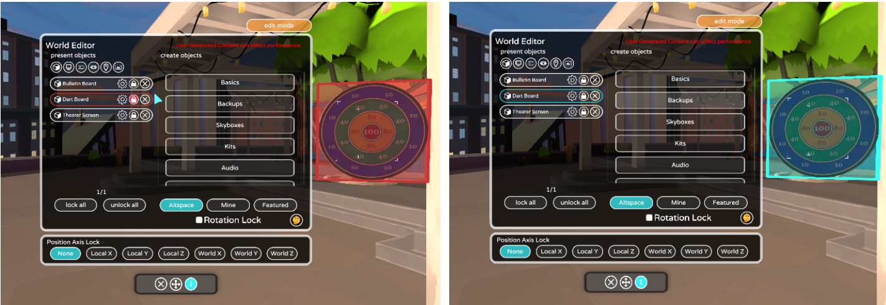
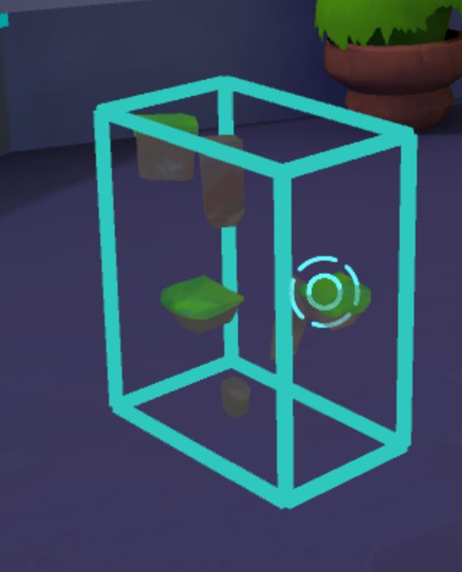
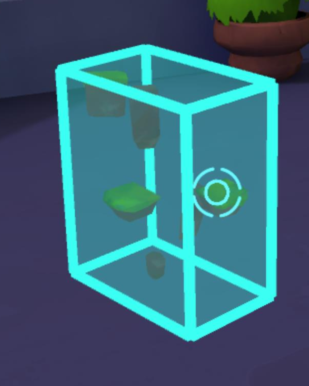
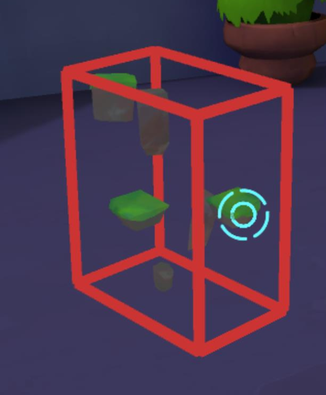
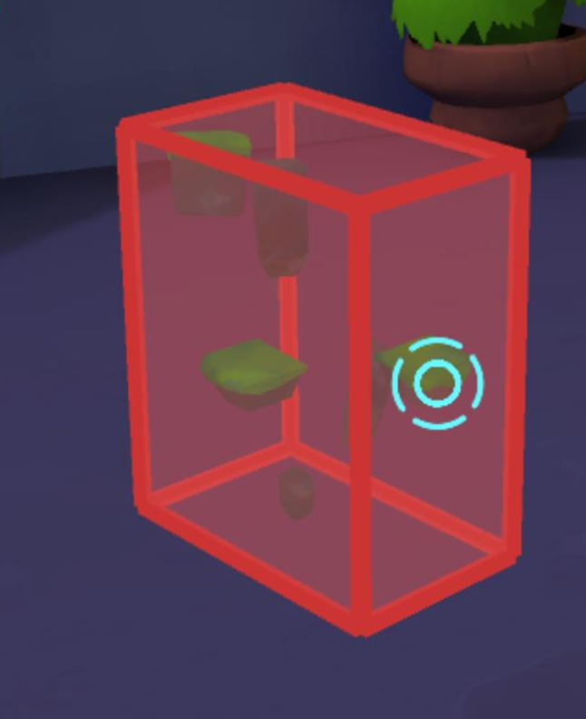
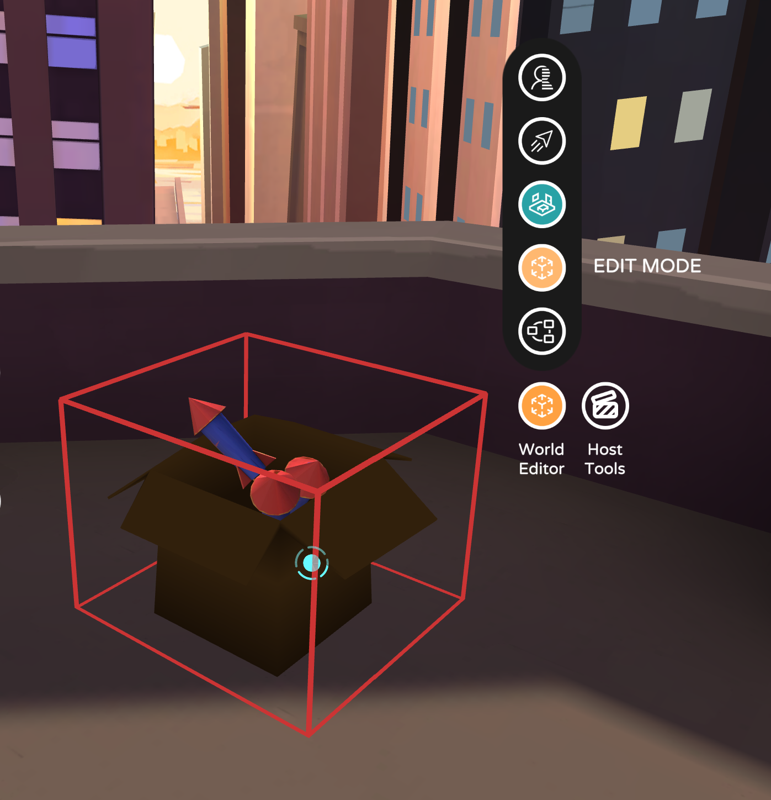

# Getting started with the World Editor

The World Editor contains the tools and abilities you need to spawn, manipulate, and place objects and elements to construct a world. It's role-dependent, which means you can only access the World Editor in places that are yours to customize, like your home-space, events, or worlds. In these spaces, your World Editor appears on the lower right-hand corner of your field of view.

The primary button in your World Editor is your **Editor Panel**. This will open your one-stop-shop window from which you have access to most of the world editing controls. The Editor Panel helps you easily tell at-a-glance which items are selected and whether they’re locked or unlocked. Items are correspondingly highlighted both in-world and in your Editor Panel, to make finding them simple. 

When you scroll over an object, a blue highlight boundary will appear. Click on the object to select it. The boundary will stay blue as long as it's selected. You can also lock an object in place to make sure it's positioned exactly where you'd like it to be. By locking the object, you'll see the highlight boundary color turn red. These colors and visual cues correspond in your Editor Panel, which makes it easy to see what you're working on and what state an object is in.

:::row:::
    :::column:::
       
        *Scroll to highlight item*
    :::column-end:::
    :::column:::
       
        *Click to select*
    :::column-end:::
    :::column:::
       
        *Scroll locked item*
    :::column-end:::
    :::column:::
       
    *Select locked item*
    :::column-end:::
:::row-end:::

The other buttons above the Editor Panel are quick short-cuts to helpful features and functions that make world-building a little smoother. 

Use your **Edit Mode** button to quickly toggle between the edit and live states. The button lights up when toggled on, so you’re able to tell which state you’re in at-a-glance even if you close your World Editor. If you're working with items that have interable properties in your World, they will be static as long as they're selected. To enable interactivity, you must de-select the item and exit Edit Mode.

Use your **Toggle Environment** button to hide or display your space. This is helpful for easy-access to items that you've placed throughout the world. By turning off the environment, you can see with less visual "noise" in your field of view.

Use your **Toggle Flight** button to enable the ability to defy gravity. Who needs a scaffolding when you can soar through the skies? Use this feature to take your “construction site” to the next level. Flying is simple: just look in the direction you want to fly and use your hot-keys (or thumbstick on controller) to get there. 

Use your **Environment Clipping** button to pass through objects with ease so you can maneuver around in 3D space without getting tripped up by the items in your world. Being able to clip through items and walls give you total freedom of movement, so you can get your World perfectly detailed.  

Remember, practice makes perfect. So hop in-world and get building with the World Editor! 

If you have other questions or want to learn from the pros, check out the #world-building channel on our community [Discord server](https://discord.com/invite/altspacevr). 

Happy building!